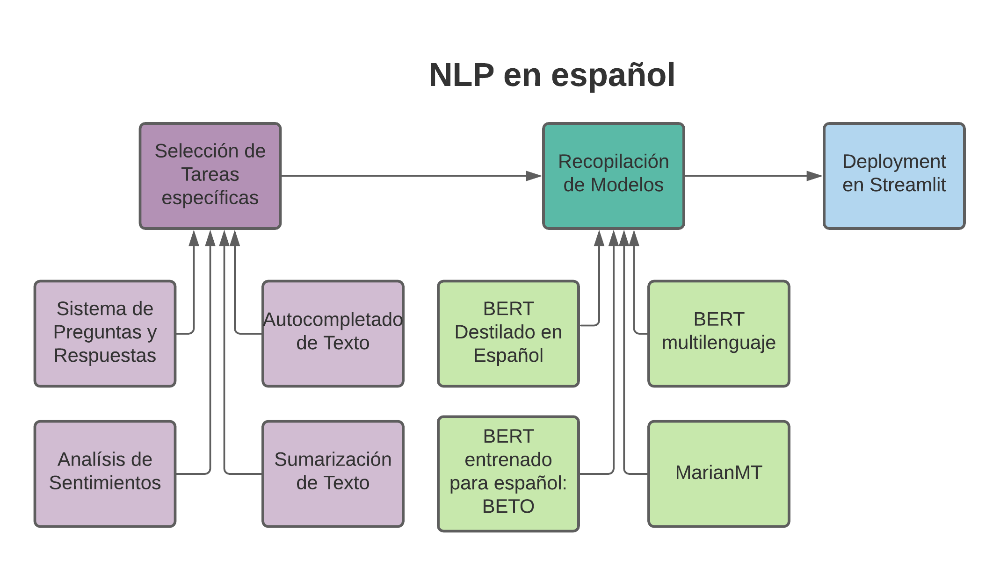
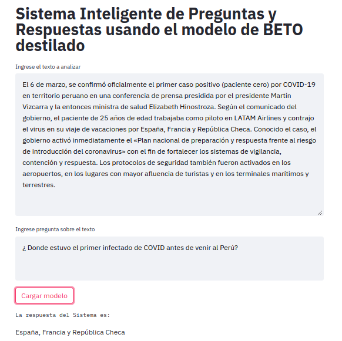
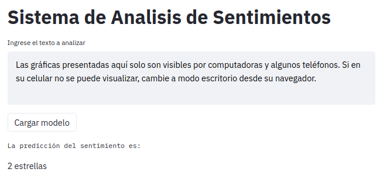
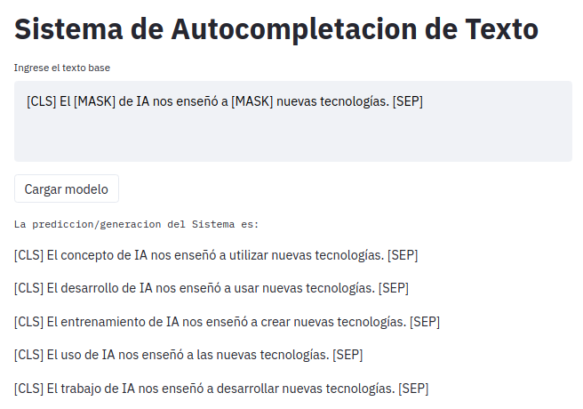
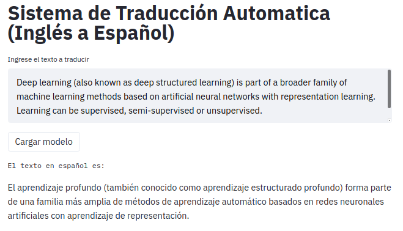

<h2 align="center">
<p>NLP en español</p>
</h2>

<h2 align="center">
<p></p>


<p></p>
</h2>


## 📜 Abstract 
This App uses the state of the art of Language Processing models Natural with APIs from HuggingFace's Transformers libraries. The models used are BERT in Spanish, distilBERT in Spanish, BERT multilanguage, XLNET, MarianMT.
To download the paper use the next [link](https://drive.google.com/file/d/101cYJhdhjsZSQFWqHexdhAwy7sV28uPH/view?usp=sharing).

## 🌀 Pipeline
Pipeline:


## 📖 Content
The following tree shows the structure of the application:
```
.
├── images
│   └── NLP_spanish.png
├── main.py
├── README.md
├── requirements.txt
└── src
    ├── components
    │   ├── fetch.py
    │   ├── home.py
    │   └── __init__.py
    │   
    ├── data
    │   ├── config.json
    │   ├── pytorch_model.bin
    │   └── vocab.txt
    ├── __init__.py
    └── models
        ├── entity_rec.py
        ├── gen_text.py
        ├── __init__.py
        ├── masked.py
        ├── question_answering.py
        ├── sent_analysis.py
        ├── summ.py
        └── translation.py
```


## ℹ️ Instructions

- For pip users, install all dependencies with the command: 
```
pip install -r requirements.txt
```
- For Conda users, you can create a new Conda environment using:
```
conda env create -f environment.yml
```

- To use ```masked.py``` download the model ```pytorch_model.bin``` in the [link](https://drive.google.com/drive/folders/1X2urs22WWZs2TmKqxJthDmYaaNdWs1oR?usp=sharing). Save this model in the folder: ```/src/data/```

- To run this project use:

``` 
streamlit run main.py
```

Below there are screenshots from app:

Question Answering:




Sentiment Analysis:



Text Autocompletation:



Translation English Spanish:



Summarization:


## 📝 Citation
If you want to cite this code for your research , please cite my paper:
```
 @article{jnavio , 
 title={Intelligent Question Answering System with NLP and
AI techniques for Spanish texts}, 
 author={Navío Torres, José Navío},
 year={2021}} 
```
If you find BETO model useful , please cite this paper:
```
@inproceedings{beto,
  title={Spanish Pre-Trained BERT Model and Evaluation Data},
  author={Cañete, José and Chaperon, Gabriel and Fuentes, Rodrigo and Ho, Jou-Hui and Kang, Hojin and Pérez, Jorge},
  booktitle={PML4DC at ICLR 2020},
  year={2020}
}

```
If you find HuggingFace libraries useful , please cite this paper:
```
@inproceedings{huggingface,
    title = "Transformers: State-of-the-Art Natural Language Processing",
    author = "Thomas Wolf and Lysandre Debut and Victor Sanh and Julien Chaumond and Clement Delangue and Anthony Moi and Pierric Cistac and Tim Rault and Rémi Louf and Morgan Funtowicz and Joe Davison and Sam Shleifer and Patrick von Platen and Clara Ma and Yacine Jernite and Julien Plu and Canwen Xu and Teven Le Scao and Sylvain Gugger and Mariama Drame and Quentin Lhoest and Alexander M. Rush",
    booktitle = "Proceedings of the 2020 Conference on Empirical Methods in Natural Language Processing: System Demonstrations",
    month = oct,
    year = "2020",
    address = "Online",
    publisher = "Association for Computational Linguistics",
    url = "https://www.aclweb.org/anthology/2020.emnlp-demos.6",
    pages = "38--45"
}
```

## 👨‍💻 Maintainers
* Jose Navío, Github: [JnavioT](https://github.com/JnavioT/) Email: jnavio@uni.pe

## 🙏🏽 Special thanks
* Version 1.0:

Thanks to the members of ACECOM-AI by the support and the patience.

Thanks to HuggingFace community by the models and tutorials [link](https://huggingface.co/).

